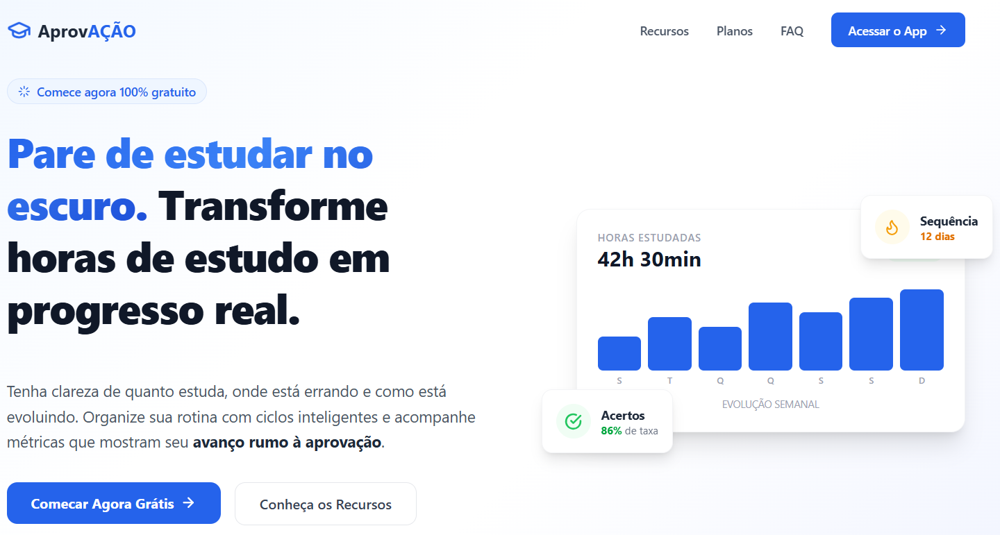
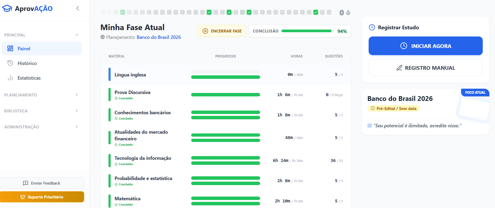
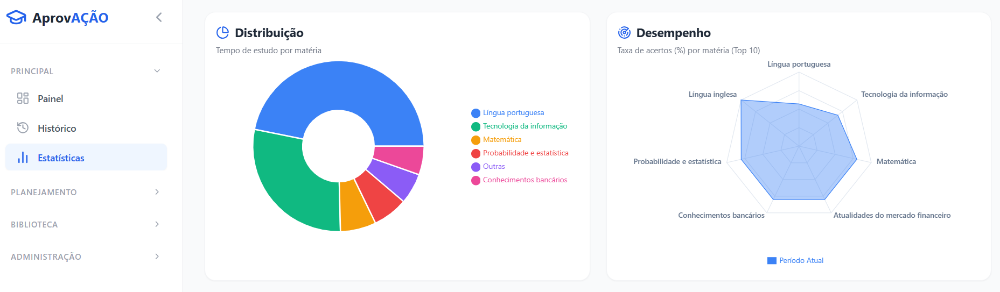

  <h1>AprovAÇÃO - Estudo de Caso SaaS</h1>
  
<strong>Plataforma completa de gestão de estudos e análise de métricas para concurseiros de alta performance.</strong>

 

## Tecnologias e Stack

  
  
  
  
  
  
  

## Visão de Produto e o Problema

O mercado de concursos públicos exige preparações de longo prazo, onde a consistência e a mensuração de resultados são fatores determinantes para a aprovação. O principal problema enfrentado pelos estudantes é a falta de organização estrutural e a ausência de métricas claras sobre o próprio desempenho, o que frequentemente resulta em ciclos de estudo ineficientes e elevada taxa de desistência.

O AprovAÇÃO atua como uma solução definitiva para esse gargalo, funcionando como um centro de comando para a gestão do conhecimento. A visão do produto está fundamentada em premissas sólidas de negócios SaaS: focar em alta conversão através de uma jornada de usuário sem atritos, garantir retenção por meio de gamificação e entrega contínua de valor (dashboards de evolução e gestão de ciclos), e consolidar receita recorrente através de um modelo de assinatura resiliente.

## Solução e Funcionalidades

A plataforma foi desenvolvida para orquestrar toda a jornada de preparação do usuário, contemplando:

*   **Dashboard de Desempenho:** Motor analítico para a visualização da evolução do estudante, cruzando dados de progresso e identificando gargalos disciplinares.
*   **Gestão de Ciclos de Estudo:** Arquitetura de planejamento estruturado que permite a organização de blocos e revisões, adaptando-se elasticamente à rotina do usuário.
*   **Fluxo de Assinatura Integrado:** Gestão de acesso baseada em tiers, totalmente integrada ao ecossistema de pagamentos para provisionamento automatizado de recursos premium.

## Arquitetura e Desafios Técnicos

A arquitetura do projeto foi estruturada com uma separação rigorosa de responsabilidades, adotando um back-end construído em Java 17 com Spring Boot para expor uma API RESTful escalável, e um front-end SPA (Single Page Application) desenvolvido em React 19 com TypeScript. A camada de persistência utiliza PostgreSQL como banco de dados relacional, abstraído via Spring Data JPA e com versionamento de schemas orquestrado pelo Flyway, garantindo rastreabilidade e integridade no modelo de dados. Para a proteção dos recursos, implementou-se Spring Security com autenticação stateless baseada em JWT, adequando perfeitamente a aplicação para o provisionamento em ambientes cloud, como o Render.

O principal desafio técnico de engenharia residiu na construção do fluxo de faturamento e na integração assíncrona com o Stripe. Foi implementada uma camada de serviço especializada para orquestrar sessões de checkout e gerenciar o portal do cliente. Para garantir consistência absoluta entre o estado financeiro remoto e a base de dados local, a aplicação conta com um `WebhookController` que atua como listener. Este controlador intercepta eventos disparados pelo Stripe, valida as assinaturas criptográficas dos payloads para prevenir injeção de dados maliciosos e atualiza o ciclo de vida das assinaturas em tempo real, mitigando condições de corrida e inconsistências de acesso.

## Interface e Telas

  
    
  
    
  

